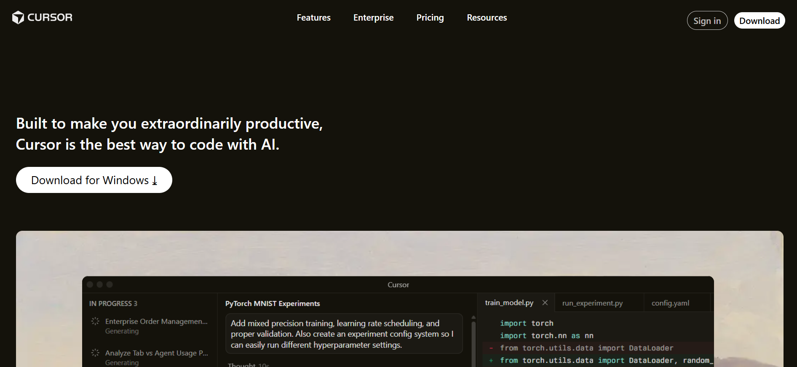
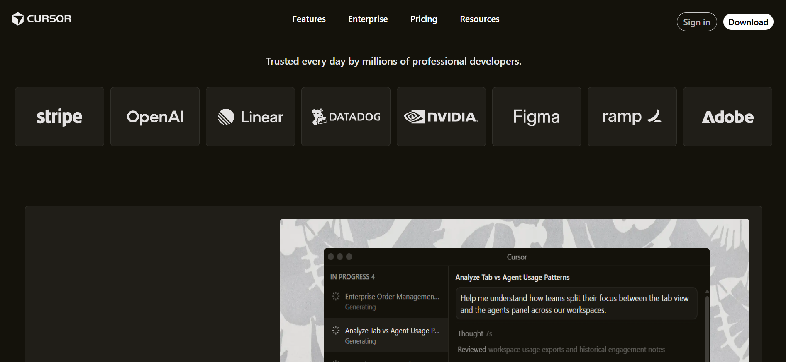
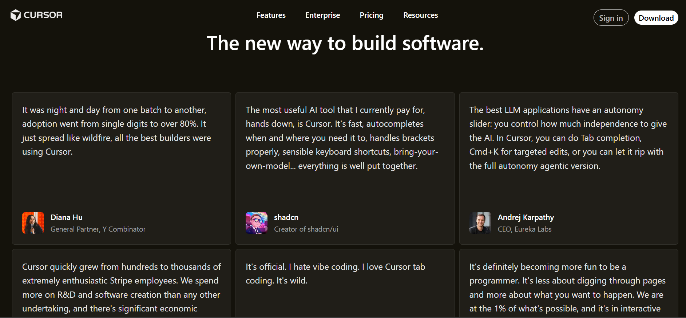
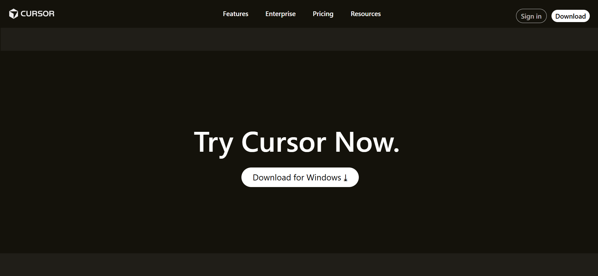

# Cursor Clone 🌐

A static **HTML & CSS front-end clone** of the Cursor AI landing page.  
This project recreates the layout and visual structure of the original Cursor website using only vanilla HTML and CSS.

---

# 📸 Screenshot







**Live Preview**
//...


## 📘 Overview

This repository contains a landing page clone of [Cursor](https://cursor.com/), focusing on layout structure and visual detail.  
The page includes multiple sections like hero, features, trusted logos, testimonials, changelog, highlights, and footer.

---

## 📦 Project Structure
```
cursor-clone/
├── assets/
│ ├── (images & icons)
├── index.html
├── style.css
└── README.md
```

---

## 💡 Recreation

✔ Top Navigation Bar with Logo, nav links, primary CTA  
✔ Hero section including main headline and CTA  
✔ Trusted companies grid  
✔ Feature Cards Section  
✔ Testimonials section  
✔ Changelog & highlights  
✔ Case Studies & Stories Section  
✔ Team / About Section  
✔ Final CTA  
✔ Footer Section  


## Fonts and Colors
- Overall Body Color - used Hex color #333
- For Certain Section - used Hex color 201E18
- For Font-Family - CursorGothic, "CursorGothic Fallback", system-ui, "Helvetica Neue", Helvetica, Arial, sans-serif;


---

## 🚀 How to Run

1. Clone the repository:
```bash
git clone //...
```

2. Open the project folder:
```
cd cursor-clone
```
3. Open index.html in a browser (e.g., Chrome, Firefox, Edge)

---

## 🛠 Tech Used

 - HTML5
 - CSS3
 - Responsive layout techniques

📌 What I Learned

- Semantic HTML page structure

- CSS Grid and Flexbox for layout

- Positioning layered images


---

## ⚠️ Known Issues

- Not fully responsive only suitable for desktop view.

- Overlay images might overlap on certain viewports

- Some styles are absolute positioned
---
## 📄 License

This project is for educational purposes and does not include a license.
Feel free to explore and learn!
