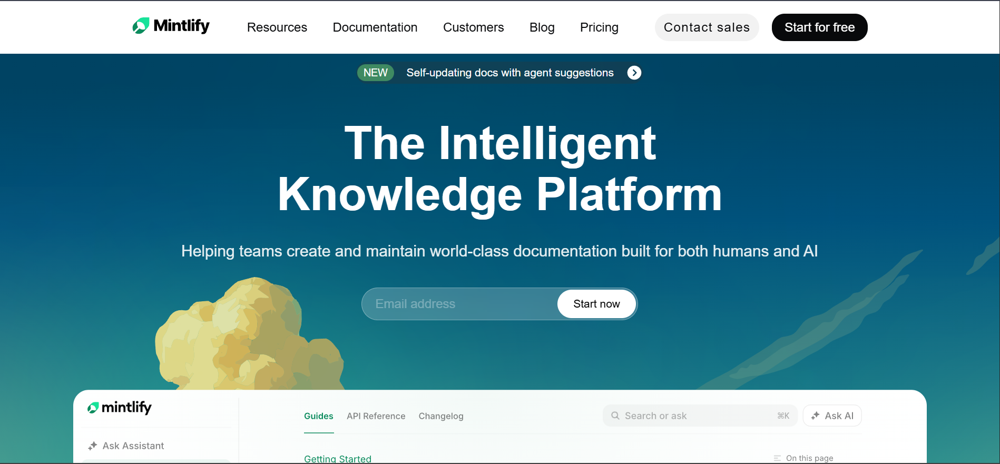
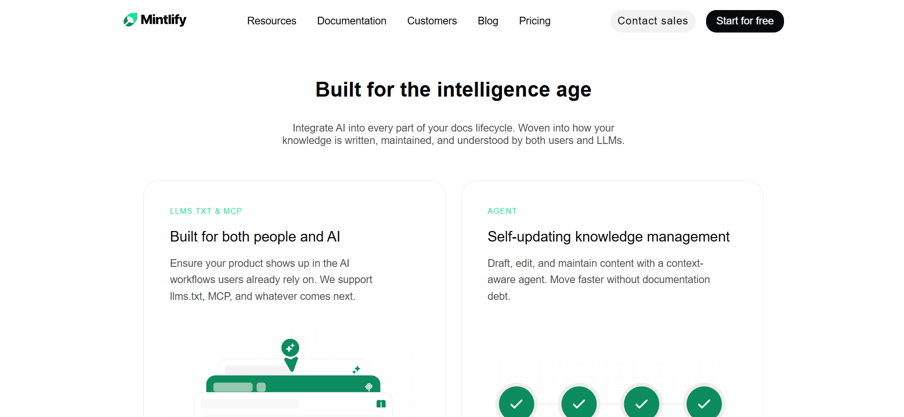
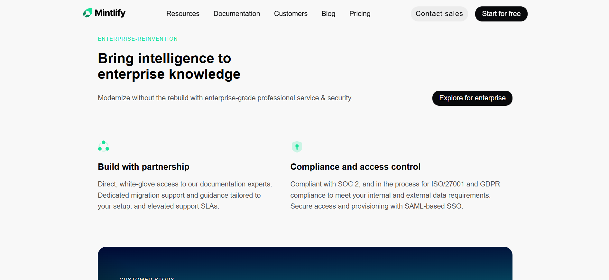
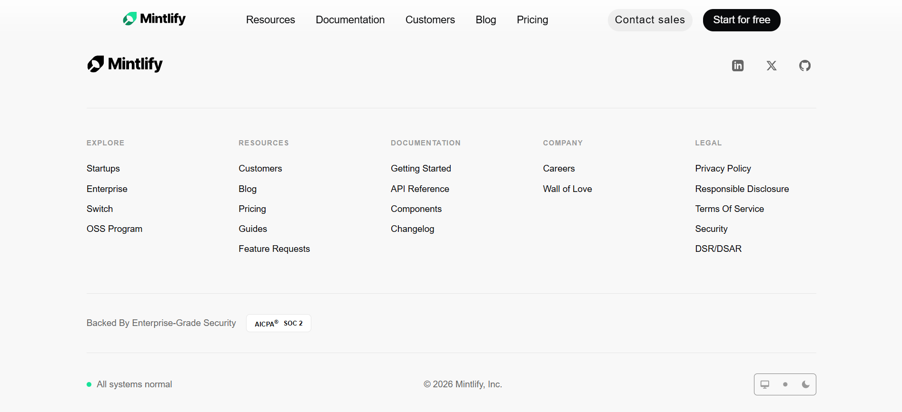

# Mintlify Landing Page Clone 🚀

A front-end clone of the [Mintlify](https://www.mintlify.com/) built using **HTML & CSS**.  
This project focuses on layout, UI styling, and modern landing page design patterns.

---

# 📸 Screenshot







---

## 🔗 Live Preview

👉 View the live demo here:
https://mintlify-clone-raw-css.netlify.app/

---

## 📦 Project Structure


```
mintlify_clone
├── index.html
├── style.css
├── assets/
│   ├── bg-light.svg
│   ├── hero-image-light.svg
│   ├── features-1.png
│   ├── features-2.png
│   ├── features-3.png
│   └── ...
└── README.md
```

---
## 💡 Recreation

✔ Top Navigation Bar with Logo, nav links, primary CTA  
✔ Hero section including main headline and CTA  
✔ Documentation Preview Section  
✔ Trusted By / Logos  
✔ Feature Highlights  
✔ Intelligent Assistant / UI Preview
✔ Enterprise Features Section 
✔ Case Studies / Customer Stories 
✔ Final CTA  
✔ Footer Section  

---

## Fonts and Colors
- Overall Body Color - used Hex color #FFFFFF
- For Certain Section - used Hex color #F8F8F8
- For Font-Family - "Inter", system-ui, -apple-system, "Segoe UI", Roboto, "Helvetica Neue", Helvetica, Arial, sans-serif

---

## 🛠 Tech Stack

- HTML5

- CSS3 (Flexbox + Grid)

- SVG Icons

- No frameworks (Pure CSS)

---
## 🚀 How to Run

1. Clone the repository locally.

2. Open the project folder:
```
cd mintlify_clone
```
3. Open index.html in a browser (e.g., Chrome, Firefox, Edge)

---

# 🙌 Credits

Design inspired by Mintlify
This project is for learning & UI practice purposes only.
